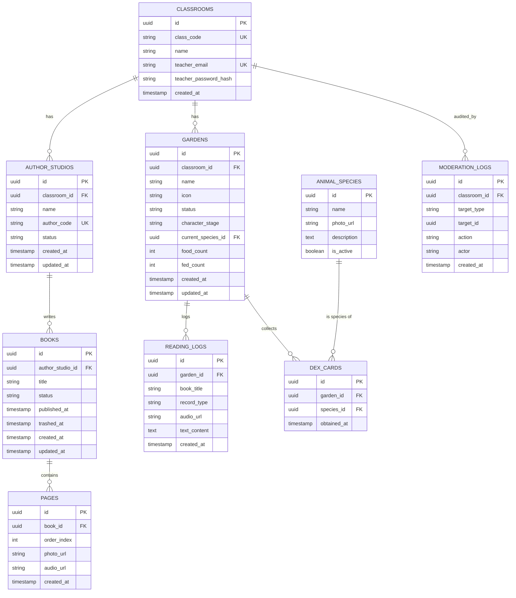

# 우리반 도서관 - DB 설계

> 기준 문서: `우리반 도서관 - PRD.md` (2026-09-29). 1차(MVP) 범위 = 단일 학급 기준 데이터 구조. 멀티테넌트 전환은 2차 범위이며, 관련 확장 포인트는 문서 하단에 별도 표기.

## 1. 설계 원칙

- **인증 없는 코드 기반 접근**: 아이/학부모는 로그인이 없으므로, `class_code` / `author_code` 는 그 자체가 사실상의 접근 키다. 두 코드 모두 **유일(unique) 인덱스**가 필수다.
- **파일은 DB에 저장하지 않는다**: 사진·녹음 파일은 클라우드 스토리지(오브젝트 스토리지)에 저장하고, DB에는 URL/스토리지 키만 보관한다.
- **삭제는 대부분 소프트 삭제**: 정책서 기준 "삭제는 콘텐츠 자체가 아닌 접근 경로만 차단"하므로, `author_studios`/`gardens`는 비활성화(soft), `books`는 상태 머신(발행됨→숨김됨→휴지통→영구삭제)을 탄다.
- **상태 변화는 감사 로그로 남긴다**: PRD 데이터 모델 섹션의 권장사항("상태 변화 이력은 관리자 모드의 운영 기록으로 남기는 것을 권장")을 `moderation_logs` 테이블로 구현한다.

## 2. ERD



## 3. 테이블 정의

### 3.1 `classrooms` (학급/도서관)

| 컬럼 | 타입 | 제약 | 설명 |
| --- | --- | --- | --- |
| id | uuid | PK | |
| class_code | varchar(6) | UNIQUE, NOT NULL | 숫자 6자리 고정. 학급 생성 시 1회 발급, 재발급 없음(1차) |
| name | text | NOT NULL | 도서관/학급 이름 |
| teacher_email | text | UNIQUE, NOT NULL | 관리자 로그인 아이디 |
| teacher_password_hash | text | NOT NULL | bcrypt 등 해시 저장(평문 금지) |
| created_at | timestamptz | NOT NULL DEFAULT now() | |

- 인덱스: `UNIQUE(class_code)`, `UNIQUE(teacher_email)`
- 1차 범위는 학급 1개 = 앱 1개 인스턴스에 가깝지만, 스키마상 classroom_id를 모든 하위 테이블에 두어 2차 멀티테넌트 전환 시 별도 마이그레이션 없이 확장 가능하게 한다.

### 3.2 `author_studios` (작가실)

| 컬럼 | 타입 | 제약 | 설명 |
| --- | --- | --- | --- |
| id | uuid | PK | |
| classroom_id | uuid | FK → classrooms.id, NOT NULL | |
| name | text | NOT NULL | 아이 이름(오타 수정 가능) |
| author_code | varchar(12) | UNIQUE, NOT NULL | 영문+숫자 조합, 작가실 생성 시 자동 발급 |
| status | enum('active','inactive') | NOT NULL DEFAULT 'active' | 선생님이 "삭제" 시 inactive로 전환(하드 삭제 아님) |
| created_at | timestamptz | NOT NULL DEFAULT now() | |
| updated_at | timestamptz | NOT NULL DEFAULT now() | |

- 인덱스: `UNIQUE(author_code)`, `INDEX(classroom_id)`
- **재발급 로직**: 재발급 시 새 `author_code`를 생성해 UPDATE하고, 이전 코드 값은 `moderation_logs`에 기록만 남기고 즉시 조회 불가 상태가 되도록(같은 컬럼을 덮어쓰므로 자연히 무효화됨) 처리한다.
- **비활성화 시 열람 차단 로직**: 도서관 문에서 `author_code` 조회 시 `status='active'`인 행만 매칭한다. `books`는 그대로 서고(1층)에 남으므로 비활성화해도 1층 서고 열람에는 영향 없음.

### 3.3 `books` (책)

| 컬럼 | 타입 | 제약 | 설명 |
| --- | --- | --- | --- |
| id | uuid | PK | |
| author_studio_id | uuid | FK → author_studios.id, NOT NULL | |
| title | text | | 자유 입력(없을 수 있음 — 그림책 특성상 제목 없이 발행 가능하면 nullable) |
| status | enum('published','hidden','trashed','deleted') | NOT NULL DEFAULT 'published' | 발행 즉시 published(승인 절차 없음) |
| published_at | timestamptz | | 최초 발행 시각 |
| trashed_at | timestamptz | | 휴지통 이동 시각. 배치 작업이 `now() - trashed_at > 30일`인 행을 `deleted`로 전환 |
| created_at | timestamptz | NOT NULL DEFAULT now() | |
| updated_at | timestamptz | NOT NULL DEFAULT now() | |

- 인덱스: `INDEX(author_studio_id)`, `INDEX(status)`
- **상태 전이**: `published ⇄ hidden`(양방향, 즉시 복구) / `published|hidden → trashed`(선생님 삭제) / `trashed → published`(복구는 항상 발행됨 상태로 되돌림 — 숨김 상태였는지는 구분하지 않음) / `trashed → deleted`(30일 경과, 스케줄러)
- `deleted` 상태에서는 연관 `pages`의 실제 파일(스토리지 오브젝트)도 함께 정리하는 배치를 둔다(선택: 완전 하드 삭제 or 소프트 유지는 운영 판단).

### 3.4 `pages` (페이지)

| 컬럼 | 타입 | 제약 | 설명 |
| --- | --- | --- | --- |
| id | uuid | PK | |
| book_id | uuid | FK → books.id, NOT NULL | |
| order_index | int | NOT NULL | 페이지 순서(드래그로 재정렬 가능해야 함) |
| photo_url | text | NOT NULL | 스토리지 객체 URL/키 |
| audio_url | text | | 녹음 없이 저장 가능(녹음 전 임시 저장 상태 고려 시 nullable) |
| created_at | timestamptz | NOT NULL DEFAULT now() | |

- 인덱스: `INDEX(book_id, order_index)`
- 순서 변경은 `order_index` 재정렬(UPDATE 여러 건) 또는 분수 인덱싱(fractional indexing) 중 택1 — 페이지 수가 적으므로 단순 정수 재정렬로 충분.

### 3.5 `gardens` (미니 정원)

| 컬럼 | 타입 | 제약 | 설명 |
| --- | --- | --- | --- |
| id | uuid | PK | |
| classroom_id | uuid | FK → classrooms.id, NOT NULL | 작가실과 완전히 별개 식별자(정책서 명시) |
| name | text | NOT NULL | |
| icon | text | | 꾸미기 요소(아이콘) 식별자 |
| status | enum('active','inactive') | NOT NULL DEFAULT 'active' | 선생님이 "삭제(비활성화)" 가능 |
| character_stage | enum('egg','hatched') | NOT NULL DEFAULT 'egg' | 성장 완료 시 `dex_cards`에 기록하고 즉시 `egg`로 리셋(사이클 반복이므로 'grown' 상태를 별도로 두지 않음) |
| current_species_id | uuid | FK → animal_species.id, NULL 허용 | 부화 시 랜덤 배정, egg로 리셋되면 NULL |
| food_count | int | NOT NULL DEFAULT 0 | 보유 먹이 개수(독서 등록 1건당 +1, 먹이 주기 1회당 -1) |
| fed_count | int | NOT NULL DEFAULT 0 | 현재 사이클 누적 먹인 횟수(10 도달 시 성장 처리 후 0으로 리셋) |
| created_at | timestamptz | NOT NULL DEFAULT now() | |
| updated_at | timestamptz | NOT NULL DEFAULT now() | |

- 인덱스: `INDEX(classroom_id)`
- **성장 트랜잭션**: `fed_count`가 10에 도달하는 UPDATE와 `dex_cards` INSERT, `character_stage`/`current_species_id`/`fed_count` 리셋은 하나의 DB 트랜잭션으로 묶어 원자성을 보장한다.

### 3.6 `reading_logs` (독서기록)

| 컬럼 | 타입 | 제약 | 설명 |
| --- | --- | --- | --- |
| id | uuid | PK | |
| garden_id | uuid | FK → gardens.id, NOT NULL | |
| book_title | text | NOT NULL | 자유 입력(앱 안팎 어떤 책이든) |
| record_type | enum('audio','text') | NOT NULL | |
| audio_url | text | | record_type='audio'일 때 |
| text_content | text | | record_type='text'일 때 |
| status | enum('visible','hidden','deleted') | NOT NULL DEFAULT 'visible' | 선생님 사후 관리(정책서: 숨기기/삭제) |
| created_at | timestamptz | NOT NULL DEFAULT now() | |

- 인덱스: `INDEX(garden_id, created_at)`
- 등록 1건 생성 시 애플리케이션 레벨에서 `gardens.food_count += 1` 트랜잭션을 함께 수행한다.

### 3.7 `animal_species` (동물 도감 카탈로그)

| 컬럼 | 타입 | 제약 | 설명 |
| --- | --- | --- | --- |
| id | uuid | PK | |
| name | text | NOT NULL | |
| photo_url | text | NOT NULL | |
| description | text | | 도감 화면에 표시되는 특징 설명 |
| is_active | boolean | NOT NULL DEFAULT true | 2차 범위의 "이벤트성 특별 동물"을 기간 한정 노출할 때 false 처리용 |

- 부화 시 `is_active=true`인 종 중 랜덤 배정(가중치 포함 확장 가능).
- MVP 정책상 "종·개수 제한 없음"이므로 초기 시드 데이터로 다양한 종을 등록해두는 운영 작업이 필요하다.

### 3.8 `dex_cards` (도감 획득 카드)

| 컬럼 | 타입 | 제약 | 설명 |
| --- | --- | --- | --- |
| id | uuid | PK | |
| garden_id | uuid | FK → gardens.id, NOT NULL | |
| species_id | uuid | FK → animal_species.id, NOT NULL | |
| obtained_at | timestamptz | NOT NULL DEFAULT now() | |

- 인덱스: `INDEX(garden_id)`
- 같은 정원이 같은 종을 여러 번 획득할 수 있음(종·개수 제한 없음 정책) → 복합 유니크 제약을 걸지 않는다.

### 3.9 `moderation_logs` (운영 기록 / 감사 로그)

| 컬럼 | 타입 | 제약 | 설명 |
| --- | --- | --- | --- |
| id | uuid | PK | |
| classroom_id | uuid | FK → classrooms.id, NOT NULL | |
| target_type | enum('book','reading_log','author_studio','garden') | NOT NULL | |
| target_id | uuid | NOT NULL | 대상 레코드 id(다형 참조, FK 제약은 애플리케이션 레벨로 관리) |
| action | enum('hide','unhide','trash','restore','permanent_delete','deactivate','reissue_code') | NOT NULL | |
| actor | text | NOT NULL | 'teacher:{email}' 또는 'system:scheduler'(자동 영구삭제 시) |
| created_at | timestamptz | NOT NULL DEFAULT now() | |

- 인덱스: `INDEX(classroom_id, created_at)`, `INDEX(target_type, target_id)`
- 관리자 화면의 "발행된 책 관리" 등에서 이력 표시가 필요해지면 이 테이블을 조인해 사용한다(1차 화면 명세에는 이력 조회 UI가 없으므로, 우선 적재만 하고 조회 UI는 2차에서 고려).

## 4. 코드 조회 로직 (도서관 문 입력 처리)

PRD 기술 요구사항의 "입력값을 학급 코드 테이블과 작가 코드 테이블에 각각 조회해 일치하는 쪽으로 분기"를 그대로 구현한다.

```sql
-- 1) 학급 코드로 조회
SELECT id FROM classrooms WHERE class_code = :input;

-- 2) 없으면 작가 코드로 조회 (status='active'인 것만)
SELECT id, name FROM author_studios
WHERE author_code = :input AND status = 'active';
```

- 두 코드의 문자 형식이 겹치지 않도록(학급 코드=숫자 6자리, 작가 코드=영문+숫자) 애플리케이션 레벨에서 먼저 정규식으로 1차 분기한 뒤 DB 조회를 1회만 태우는 것이 성능상 더 낫다.

## 5. 배치/스케줄러

| 작업 | 주기 | 로직 |
| --- | --- | --- |
| 휴지통 자동 영구삭제 | 매일 1회 | `UPDATE books SET status='deleted' WHERE status='trashed' AND trashed_at < now() - interval '30 days'`, 이후 연관 스토리지 파일 정리, `moderation_logs`에 `actor='system:scheduler'`로 기록 |

## 6. 2차(멀티테넌트) 확장 시 변경 포인트

- `classrooms`를 `teachers`(1) : `classrooms`(N) 구조로 분리 — 현재는 선생님 계정 정보가 `classrooms`에 바로 들어있어 선생님 1인 = 학급 1개 가정
- 모든 하위 테이블에 이미 `classroom_id`가 있으므로, RLS(행 수준 보안) 또는 애플리케이션 레벨 필터로 학급 간 데이터 격리만 추가하면 됨
- `class_code` 재발급 기능 추가 시: 컬럼 자체는 그대로 두고 UPDATE + `moderation_logs` 기록만 추가하면 됨(스키마 변경 불필요)
- 학부모 동의 기록: `author_studios`에 `parent_consent_at timestamptz NULL` 컬럼 추가로 확장 가능
