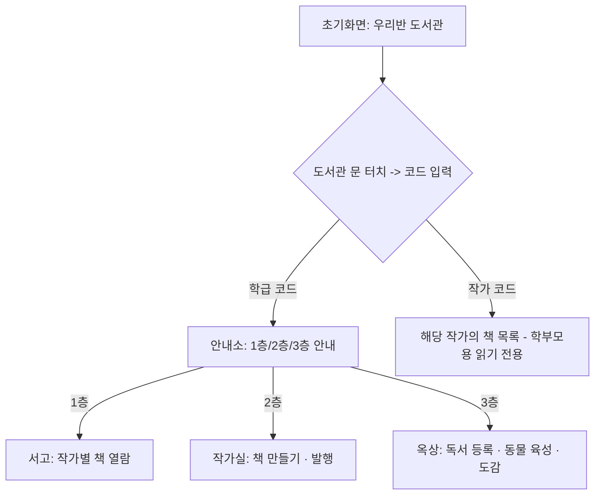

# 우리반 도서관 - PRD

Sep 29, 2026

## 개요

**제품명**: 우리반 도서관

유치원/어린이집 한 반 전용 웹 기반 디지털 도서관 앱. 아이들이 종이에 그린 그림을 사진으로 등록해 전자책으로 만들고, 페이지마다 음성을 녹음해 실제 책처럼 읽을 수 있다. 도서관이라는 공간 은유(1층 서고 · 2층 작가실 · 3층 옥상)로 아이들이 직관적으로 이해하고 즐길 수 있도록 설계한다.

### 배경 및 문제 정의

유치원/어린이집에서 아이들이 직접 그리고 만든 그림책은 대부분 종이 형태로 교실 한켠에 보관되다가 학기가 끝나면 흩어지거나 사라지는 경우가 많다. 아이가 그림책에 담아 표현한 이야기와 목소리는 기록되지 않은 채 순간으로 그치고, 다른 반 친구나 학부모가 이를 함께 감상할 기회도 제한적이다. 우리반 도서관은 이런 한계를 디지털로 보완해, 아이들의 창작물을 오래 보존하고 언제든 다시 꺼내 볼 수 있는 공간을 만든다.

## 목표 및 기대 효과

### 목표

1. 아이들이 직접 그린 그림책을 사진과 음성으로 손쉽게 디지털화해 기록으로 남긴다
2. 같은 반 친구들의 작품을 자유롭게 읽고 들으며 서로의 창작물에 관심을 갖게 한다
3. 독서와 창작 활동을 게임처럼 재미있게 느끼도록 만들어 아이들의 자발적인 참여를 이끈다

### 기대 효과

- 아이들의 창작물이 사라지지 않고 디지털 기록으로 축적되어, 성장 과정을 돌아볼 수 있는 자산이 된다
- 독서 기록을 게임처럼 만드는 육성 시스템을 통해 아이들이 스스로 책 읽기에 흥미를 갖게 된다
- 로그인 없는 간편한 접근 방식으로, 유아 눈높이에 맞는 사용성을 확보한다
- 선생님은 최소한의 관리 부담으로 학급 전체의 창작·도서 활동을 한눈에 파악할 수 있다
- 학부모는 별도 절차 없이 자녀의 성장 과정을 자연스럽게 지켜볼 수 있다

## 타겟 사용자

- **아이 (주 사용자, 5\~7세)**: 글자보다 그림과 아이콘으로 이해하고 조작하는 유치원/어린이집 아동. 그림책을 만들고, 친구들의 책을 읽고, 독서 기록을 쌓아 동물을 키운다
- **학부모 (부가 사용자)**: 로그인이나 앱 설치 없이 코드 하나로 자녀가 만든 책을 읽기 전용으로 열람한다
- **담임 선생님 (관리자)**: 학급을 개설하고, 발행된 콘텐츠와 학생별 공간을 사후 관리하는 운영자 역할을 맡는다

## 핵심 컨셉 및 전체 사용자 흐름

우리반 도서관은 도서관이라는 공간 은유를 그대로 앱 구조에 반영한다. 도서관 문에서 코드를 입력해 입장하면, 안내소를 거쳐 세 개의 공간으로 나뉜다.

- **1층 서고**: 반 친구들이 발행한 책을 자유롭게 열람하는 공간
- **2층 작가실**: 자신의 개인 작가실에서 그림책을 만들고 발행하는 공간
- **3층 옥상**: 개인별 미니 정원에서 독서 기록을 쌓아 동물을 키우고 도감을 모으는 공간

## 개발 범위

| 구분 | 포함 기능 |
| --- | --- |
| **1차 (MVP, 웹앱)** | 학급 코드로 도서관 입장 · 로그인 없이 작가실 선택/생성 · 작가실 생성 시 작가 코드 자동 발급 · 도서관 문 코드 입력창이 학급코드/작가코드를 구분해 학부모를 해당 작가의 책 목록으로 연결 · 사진 등록·순서 정렬(제한 없음) · 페이지별 녹음(제한 없음) · 발행 즉시 서고 공개(승인 없음) · 1층 서고에서 작가별로 열람(페이지 넘김 + 녹음 자동 재생) · 발행 후 자유로운 수정/삭제 · 선생님용 사후 콘텐츠 숨김/휴지통삭제 · 작가 코드 재발급 관리기능 · 3층 옥상 개인 미니 정원(알→부화→먹이→성장→도감 카드 수집) · 독서 등록(녹음 또는 직접쓰기, 책 제목 자유 입력) · 1층/2층/3층 기본 네비게이션 · 단일 학급 기준 데이터 구조 |
| **2차 (고도화)** | 도서관 문 유도 모션·책장 넘기는 세밀한 애니메이션 · SNS풍 작가 프로필 · 여러 반/학급 동시 지원(멀티테넌트 구조 전환) · 학급 코드 재발급 기능 · 오프라인 촬영 후 자동 업로드 · 네이티브 앱 전환 · 학부모 동의 여부 기록 · 도감 동물 종 확장(이벤트성 특별 동물 등) |

## 코드 체계

모든 출입구는 도서관 문의 하나의 코드 입력창으로 통합된다. 서버는 입력값의 형식으로 두 종류를 자동 구분한다.

| 코드 | 형식 | 발급 시점 | 입력 시 동작 |
| --- | --- | --- | --- |
| 학급 코드 | 숫자 6자리 고정 | 학급 생성 시 1회 발급, 학기/학년 동안 고정 | 안내소로 이동(아이용 플로우) |
| 작가 코드 | 영문+숫자 조합 | 작가실을 처음 만들 때 자동 발급 | 해당 작가가 발행한 책 목록(읽기 전용)으로 즉시 이동 |

작가 코드는 재발급 가능하며, 재발급 시 기존 코드는 즉시 무효화된다. 정원(3층 미니 정원)은 별도 코드 없이 이름으로만 구분되는 독립 식별자다.

## 화면별 상세 기능 요구사항

| 화면 | 주요 구성 | 핵심 동작 |
| --- | --- | --- |
| 초기화면 | "우리반 도서관" 타이틀, 중앙에 큰 도서관 일러스트 | 도서관 문 터치 시 유도 모션 후 코드 입력창 표시. 학급 코드면 안내소로(아이용), 작가 코드면 해당 작가의 책 목록(읽기 전용, 학부모용)으로 이동 |
| 안내소 | 도서관 프론트 데스크 느낌의 디자인, 1층/2층/3층 안내판 | 1층 터치 → 서고, 2층 터치 → 작가실 로비, 3층 터치 → 옥상 |
| 1층 서고 | 도서관 내부 인테리어, 작가(아이) 목록 | 작가 선택 → 그 작가의 책 목록으로 이동. 안내소로 돌아가기 버튼 상시 |
| 작가의 책 목록 | 선택한 작가가 발행한 책 표지 모음 | 책 선택 → 전자책 리더로 이동 |
| 전자책 리더 | 실제 책처럼 페이지 넘김 애니메이션 | 페이지를 넘길 때마다 해당 페이지에 녹음된 음성이 자동 재생 |
| 2층 작가실 로비 | 개인 작가실 목록(이름/아이콘), 작가실 생성 버튼 | 목록에서 자기 작가실 터치 → 바로 이동. 생성 버튼 → 이름 입력으로 작가실 생성(작가 코드 자동 발급). 안내소로 돌아가기 버튼 상시 |
| 개인 작가실 | 좌상단 작가 프로필(작가 코드 표시+복사), 좌하단 "새로운 책 쓰기" 버튼, 우측 "내가 만든 책" 목록 | 새 책 쓰기 → 책 만들기 플로우. 기존 책은 자유롭게 수정/삭제 가능 |
| 책 만들기 - 사진 등록 | 사진 넣기 버튼, 등록 순서대로 번호 매겨진 사진 그리드 | 사진 드래그로 순서 수정, 완료 후 "책 만들기" 버튼 |
| 책 만들기 - 조립 | 사진→책 페이지 조립 애니메이션 | 자동 진행 후 녹음 단계로 |
| 책 만들기 - 녹음 | 페이지 한 장씩 넘어가며 녹음 | 페이지별 녹음/재녹음, 완료 후 "발행" 버튼 |
| 발행 완료 | 발행 버튼 터치 시 승인 절차 없이 즉시 처리 | 발행 즉시 1층 서고 공개 + "내가 만든 책"에 추가. 해당 작가 코드로 즉시 열람 가능. 이후 자유로운 재수정/삭제 |
| 3층 옥상 | 개인별 미니 정원 목록(이름/아이콘), "새 정원 만들기" 버튼 | 정원 선택 → 바로 이동(로그인·PIN 없음). 새 정원은 이름+아이콘으로 생성. 안내소로 돌아가기 버튼 상시 |
| 개인 미니 정원 | 중앙에 알/벌레/동물, 하단에 먹이 추가·먹이 주기·도감 버튼, 우측 상단 옥상 가기 버튼 | 알 터치 → 부화. 먹이 추가 → 독서 등록창. 먹이 주기 → 10회 누적 시 성장 + 도감 등록 + 새 알 생성. 도감 → 도감 화면 |
| 독서 등록창 | 책 제목 입력창, 녹음/직접쓰기 선택, 누적 독서 기록 목록 | 제목 입력 + 녹음 또는 글쓰기로 등록 시 먹이 1개 생성. "정원가기" 버튼으로 복귀 |
| 도감 | 모은 동물 카드 컬렉션(그리드) | 카드 터치 시 동물 사진+특징 설명 표시. 정원으로 돌아가기 버튼 상시 |

## 3층 옥상 - 독서 육성 시스템 상세 로직

2층 작가실과는 별개의 개인 공간으로, 아이 개인별 독서 습관을 게임처럼 만드는 수집형 육성 시스템이다.

1. **옥상 진입**: 안내소에서 3층 선택 → 개인별 미니 정원 목록과 "새 정원 만들기" 버튼 표시. 로그인/PIN 없이 목록에서 선택하면 바로 입장. 새 정원은 이름+아이콘으로 생성. 작가실과 완전히 별개의 식별자로 관리
2. **부화**: 알 상태에서 알을 터치하면 부화 애니메이션 후 벌레/동물 등장
3. **독서 등록(먹이 추가)**: 책 제목을 자유롭게 입력(앱 안팎 어떤 책이든 가능), 녹음 또는 직접 글쓰기로 등록. 등록 시마다 누적 독서 기록이 목록에 표시. 등록 완료 시 먹이 1개 생성, 등록 횟수 제한 없음. "정원가기" 버튼으로 복귀
4. **먹이 주기**: 버튼 터치 시 먹는 모션 재생, 먹이 1개 소모(먹이 없으면 불가). 누적 10회 먹이면 성장 → 도감 자동 등록 + 새 알 재생성(사이클 반복)
5. **도감**: 모은 동물 카드 컬렉션을 그리드로 표시(종·개수 제한 없음). 카드 터치 시 동물 사진과 간단한 특징 설명 표시

## 선생님 관리자 모드 기능

- **로그인**: 학급 생성 시 설정한 이메일+비밀번호로 로그인(비밀번호 찾기 포함). 초기화면 "선생님이신가요?" 링크로 진입
- **개요 화면**: 도서관 이름, 학급 코드(재확인/복사), 작가실 수, 발행된 책 수
- **발행된 책 관리**: 전체 책 목록(작가·발행일·페이지 수). 클릭 시 사진+녹음 미리보기. "숨기기"(즉시 비공개, 복구 가능)와 "삭제"(휴지통 이동) 버튼
- **휴지통**: 삭제된 책은 30일간 보관, 그 사이 "복구" 가능. 기간 만료 시 자동 영구 삭제
- **작가실 관리**: 학생(작가실) 목록, 이름 오타 수정, 작가 코드 확인/재발급(재발급 시 기존 코드 즉시 무효화), 작가실 삭제(비활성화 — 발행된 책은 서고에 유지되나 해당 작가 코드로는 열람 불가)
- **정원/독서기록 관리**: 학생별 미니 정원 목록, 부적절한 독서 기록(녹음/글) 숨기기·삭제, 정원 삭제(비활성화)
- **학급 코드 확인 화면**
- **권한 범위**: 사진·녹음 콘텐츠 자체는 수정하지 않고, 숨김/삭제/복구/작가실·정원 관리 등 운영 기능만 수행

## 데이터 모델

| 엔티티 | 주요 속성 |
| --- | --- |
| 학급(도서관) | 학급 코드, 이름, 개설일, 선생님 이메일/비밀번호 |
| 작가실 | 이름, 작가 코드, 상태(활성/비활성화) |
| 책 | 제목, 작가, 페이지 수, 발행상태(발행됨/숨김됨/휴지통/영구삭제), 발행일 |
| 페이지 | 사진 파일, 녹음 파일, 순서 |
| 미니 정원 | 이름, 꾸미기 요소(아이콘), 캐릭터 상태(알/부화/성장), 먹이 개수, 누적 먹인 횟수 |
| 독서기록 | 책 제목(자유 입력), 녹음 파일 또는 텍스트, 등록일시, 소속 정원 |
| 도감카드 | 동물 종류, 사진, 특징 설명, 소속 정원, 등록일 |

책과 독서기록은 각각 상태값을 가지며, 상태 변화 이력(숨김/삭제/복구 시점)은 관리자 모드의 운영 기록으로 남기는 것을 권장한다.

## 기술 요구사항

- **프론트**: 반응형 웹앱(태블릿/모바일 브라우저 기준). 아이용 화면과 선생님용 관리자 화면은 라우트로 분리(예: /admin). 학부모용 화면은 별도 라우트 없이 도서관 문 코드 입력 결과에 따라 분기되는 화면 상태로 구현
- **백엔드**: 고정 코드 인증(아이용) + 작가 코드 읽기 전용 접근(학부모용) + 이메일/비밀번호 인증(선생님용), 이미지/오디오 파일 업로드와 클라우드 저장, 데이터베이스
- **도서관 문 코드 입력 처리**: 입력값을 학급 코드 테이블과 작가 코드 테이블에 각각 조회해 일치하는 쪽으로 분기
- **책 상태값 관리**: 발행됨/숨김됨/휴지통(30일 후 자동 영구삭제)/영구삭제된 상태를 관리하는 백엔드 로직(휴지통 자동 만료 처리는 스케줄러/배치 작업)
- **카메라/녹음**: 사진 촬영 후 즉시 업로드(오프라인 촬영 미지원), 녹음/재생 기능(시간 제한 없음). 페이지 넘김 시 해당 페이지 오디오 자동 재생
- **육성 로직(3층 옥상)**: 독서 등록 1건당 먹이 1개 지급 → 먹이 주기 10회 누적 시 캐릭터 성장 → 도감 카드 저장 + 새 알 자동 생성(먹이 개수와 먹인 횟수를 정원별로 추적)
- **발행 로직**: 승인 없이 즉시 처리(발행 시 별도 공유 링크는 생성하지 않음 — 작가 코드가 그 역할을 대체)

## 운영 정책 요약

### 계정 및 코드 관리

- 보안보다 사용 편의성을 우선하는 교실 내 신뢰 기반 도구로 운영. 복잡한 인증 절차를 두지 않는다
- 아이는 개인 계정/로그인 없이 학급 코드로 입장, 입장 후 별도 인증 없이 자유롭게 이동
- 작가실·미니 정원에는 PIN 등 보호 장치를 두지 않는다(사용성 우선)
- 학급 코드는 학기/학년 동안 고정(1차 범위에 재발급 기능 없음)
- 작가 코드는 유출/오전달 시 선생님이 재발급 가능(재발급 시 기존 코드 즉시 무효화)

### 콘텐츠 발행 및 사후관리

- 사전 승인 없이 발행 즉시 1층 서고에 공개
- 발행 후에도 자유롭게 수정/삭제 가능
- "숨기기"는 즉시 비공개(언제든 복구 가능), "삭제"는 휴지통 이동 후 30일 뒤 자동 영구 삭제
- 독서 기록(녹음/글)도 동일 기준으로 관리

### 개인정보 및 실명 노출

- 1층 서고·학부모 열람 화면에는 작가(아이) 실명이 표시됨(소규모 신뢰 기반 공유 전제)
- 학부모 동의 여부 기록/관리는 앱 범위 밖(선생님이 앱 밖에서 별도 안내 전제)
- 콘텐츠는 클라우드에 저장되며, 접근은 해당 학급 코드/작가 코드 보유자로 제한

### 작가실/미니 정원 비활성화 및 삭제

- 작가실 삭제 시 해당 작가실만 비활성화, 이미 발행된 책은 서고에 유지되나 작가 코드로는 열람 불가
- 미니 정원도 동일 원칙으로 관리
- 삭제는 콘텐츠 자체가 아닌 접근 경로만 차단(창작물 최대 보존 원칙)

### 독서 육성 시스템 운영

- 독서 등록(먹이 추가) 횟수에 하루/기간 제한 없음, 등록 대상 책도 제한 없음
- 도감 동물은 특정 종류/개수로 제한하지 않음
- 성장 완료 동물은 도감 카드로 영구 보존, 화면에는 곧바로 새 알 생성

### 관리자 권한 범위

선생님은 다음 운영 기능만 수행하며, 아이가 만든 사진·녹음 콘텐츠 자체는 직접 수정하지 않는다: 발행된 책 숨기기·삭제·복구, 독서 기록 숨기기·삭제, 작가실/미니 정원 이름 수정·삭제(비활성화), 작가 코드 확인·재발급, 학급 코드 확인, 학급 개요 조회

## 리스크 및 향후 정책 검토 사항 (2차 범위)

- 인증 없는 구조(학급 코드/작가 코드 공유 기반)이므로, 코드가 유출되면 제3자가 서고나 작가실에 접근할 수 있는 리스크가 있다 — 1차에서는 사용성을 우선하되, 재발급 절차로 완화
- 실명 노출 정책은 학부모 동의 전제가 앱 밖에서 별도로 이뤄진다는 가정에 의존 — 동의 미이행 시 개인정보 노출 리스크
- 학부모 동의 여부를 앱 내에서 기록·관리하는 절차 도입 여부
- 여러 학급/반을 동시 지원하는 멀티테넌트 구조로 전환할 때의 데이터 격리 정책
- 학급 코드 재발급 기능과 그에 따른 기존 이용자 안내 절차
- 도감에 이벤트성 특별 동물을 추가할 경우의 운영 기준
