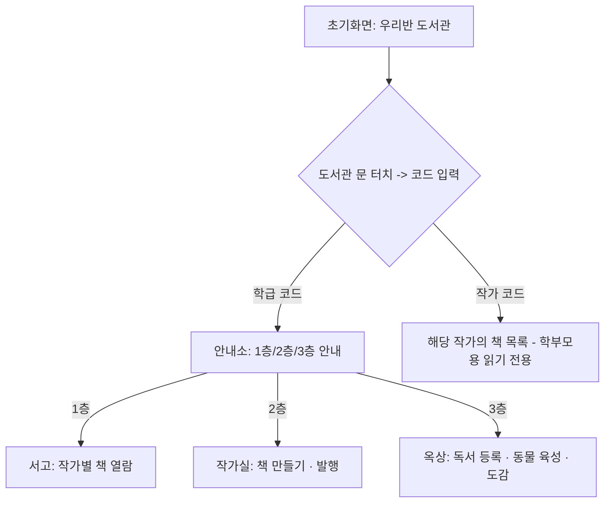

# 우리반 도서관 - 기획서

Sep 29, 2026 · @바바바

## 프로젝트 개요

**앱 이름**: 우리반 도서관

유치원/어린이집 한 반 전용으로, 아이들이 종이에 그린 그림을 사진으로 등록해 전자책을 만들고, 페이지마다 음성 녹음을 더해 진짜 책처럼 읽을 수 있는 학급 전용 웹 기반 디지털 도서관 앱입니다. 도서관이라는 공간 은유를 통해 아이들이 직관적으로 이해하고 즐길 수 있도록 설계합니다.

## 배경 및 문제 정의

유치원/어린이집에서 아이들이 직접 그리고 만든 그림책은 대부분 종이 형태로 교실 한켠에 보관되다가 학기가 끝나면 흩어지거나 사라지는 경우가 많습니다. 아이가 그림책에 담아 표현한 이야기와 목소리는 기록되지 않은 채 순간으로 그치고, 다른 반 친구나 학부모가 이를 함께 감상할 기회도 제한적입니다. 우리반 도서관은 이런 한계를 디지털로 보완해, 아이들의 창작물을 오래 보존하고 언제든 다시 꺼내 볼 수 있는 공간을 만듭니다.

## 목표

1. 아이들이 직접 그린 그림책을 사진과 음성으로 손쉽게 디지털화해 기록으로 남긴다
2. 같은 반 친구들의 작품을 자유롭게 읽고 들으며 서로의 창작물에 관심을 갖게 한다
3. 독서와 창작 활동을 게임처럼 재미있게 느끼도록 만들어 아이들의 자발적인 참여를 이끈다

## 타겟 사용자

- **아이(주 사용자, 5\~7세)**: 글자보다 그림과 아이콘으로 이해하고 조작하는 유치원/어린이집 아동. 그림책을 만들고, 친구들의 책을 읽고, 독서 기록을 쌓아 동물을 키운다
- **학부모(부가 사용자)**: 로그인이나 앱 설치 없이 코드 하나로 자녀가 만든 책을 읽기 전용으로 열람한다
- **담임 선생님(관리자)**: 학급을 개설하고, 발행된 콘텐츠와 학생별 공간을 사후 관리하는 운영자 역할을 맡는다

## 핵심 컨셉

우리반 도서관은 도서관이라는 공간 은유를 그대로 앱 구조에 반영합니다. 도서관 문에서 코드를 입력해 입장하면, 안내소를 거쳐 세 개의 공간으로 나뉩니다.

- **1층 서고**: 반 친구들이 발행한 책을 자유롭게 열람하는 공간
- **2층 작가실**: 자신의 개인 작가실에서 그림책을 만들고 발행하는 공간
- **3층 옥상**: 개인별 미니 정원에서 독서 기록을 쌓아 동물을 키우고 도감을 모으는 공간

**전체 사용자 흐름**

## 주요 기능 요약

**1층 서고**: 작가별로 정리된 책 목록에서 원하는 책을 선택해 실제 책처럼 페이지를 넘기며 읽고, 페이지마다 녹음된 음성을 들을 수 있습니다.

**2층 작가실**: 사진을 등록해 순서를 정하고, 페이지별로 음성을 녹음해 나만의 전자책을 만들어 승인 절차 없이 즉시 발행합니다. 발행 후에도 자유롭게 수정·삭제할 수 있습니다.

**3층 옥상**: 읽은 책을 녹음이나 글로 등록할 때마다 먹이가 생기고, 먹이를 모아 동물에게 주면 성장해 도감에 카드로 남습니다. 성장이 끝나면 새 알이 다시 생겨 계속 새로운 동물을 모을 수 있습니다.

또한 학부모는 자녀의 작가 코드로 언제든 자녀의 책을 읽어볼 수 있고, 선생님은 별도 관리자 모드에서 학급 전체를 운영합니다.

## 개발 범위

| 구분 | 포함 기능 |
| --- | --- |
| **1차 (MVP, 웹앱)** | 학급 코드로 도서관 입장 · 로그인 없이 작가실 선택/생성 · 작가실 생성 시 작가 코드 자동 발급 · 도서관 문 코드 입력창이 학급코드/작가코드를 구분해 학부모를 해당 작가의 책 목록으로 연결 · 사진 등록·순서 정렬(제한 없음) · 페이지별 녹음(제한 없음) · 발행 즉시 서고 공개(승인 없음) · 1층 서고에서 작가별로 열람(페이지 넘김 + 녹음 자동 재생) · 발행 후 자유로운 수정/삭제 · 선생님용 사후 콘텐츠 숨김/휴지통삭제 · 작가 코드 재발급 관리기능 · 3층 옥상 개인 미니 정원(알→부화→먹이→성장→도감 카드 수집) · 독서 등록(녹음 또는 직접쓰기, 책 제목 자유 입력) · 1층/2층/3층 기본 네비게이션 · 단일 학급 기준 데이터 구조 |
| **2차 (고도화)** | 도서관 문 유도 모션·책장 넘기는 세밀한 애니메이션 · SNS풍 작가 프로필 · 여러 반/학급 동시 지원(멀티테넌트 구조 전환) · 학급 코드 재발급 기능 · 오프라인 촬영 후 자동 업로드 · 네이티브 앱 전환 · 학부모 동의 여부 기록 · 도감 동물 종 확장(이벤트성 특별 동물 등) |

## 기대 효과

- 아이들의 창작물이 사라지지 않고 디지털 기록으로 축적되어, 성장 과정을 돌아볼 수 있는 자산이 됩니다
- 독서 기록을 게임처럼 만드는 육성 시스템을 통해 아이들이 스스로 책 읽기에 흥미를 갖게 됩니다
- 로그인 없는 간편한 접근 방식으로, 유아 눈높이에 맞는 사용성을 확보합니다
- 선생님은 최소한의 관리 부담으로 학급 전체의 창작·도서 활동을 한눈에 파악할 수 있습니다
- 학부모는 별도 절차 없이 자녀의 성장 과정을 자연스럽게 지켜볼 수 있습니다
